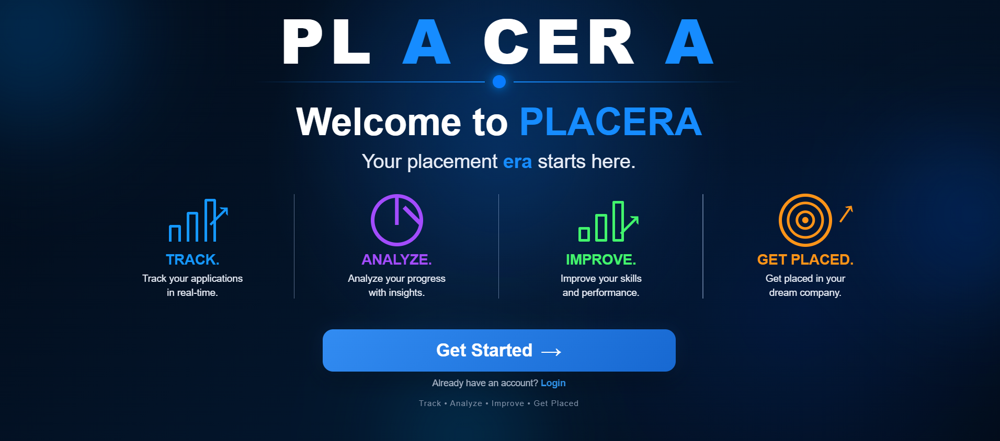
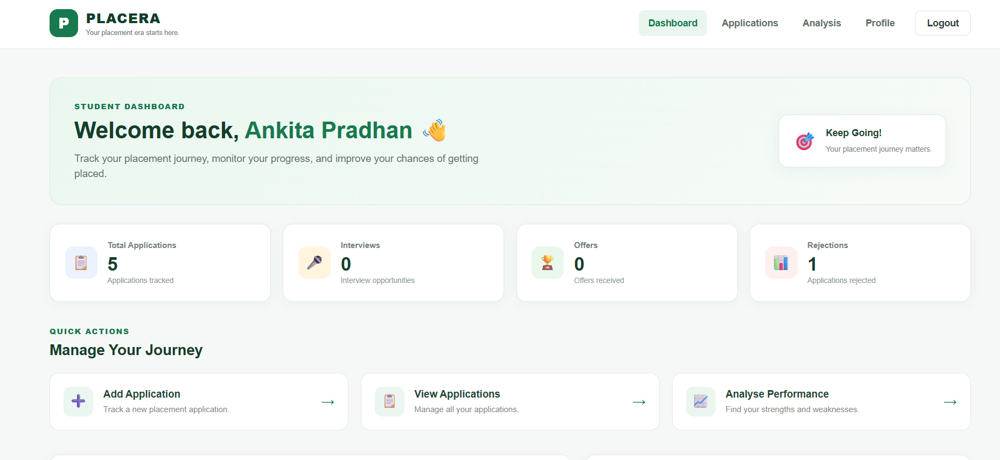
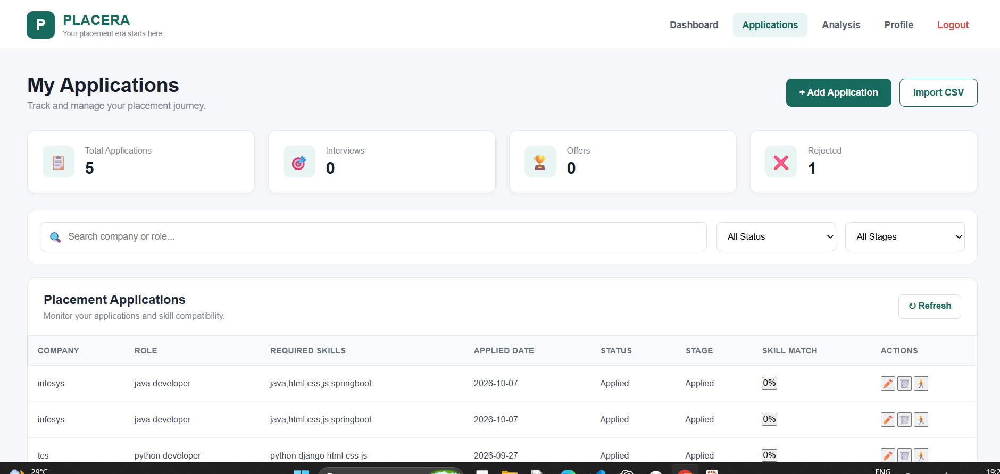
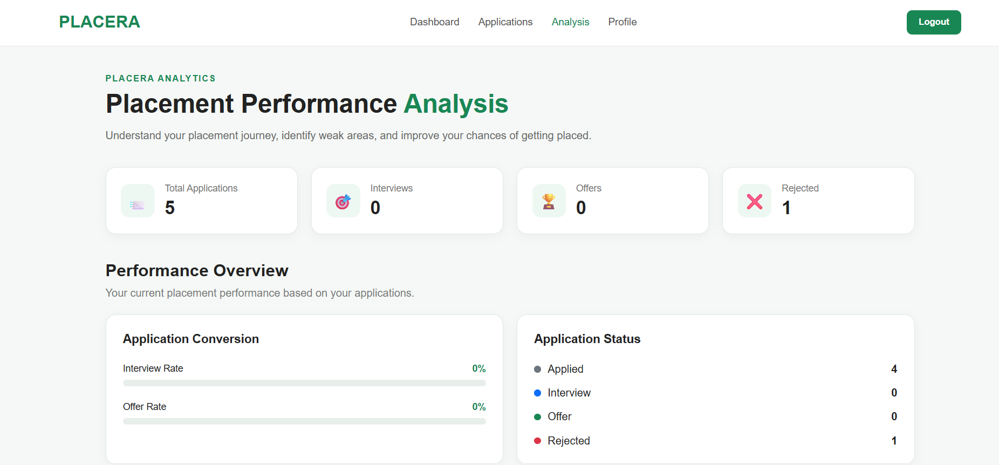
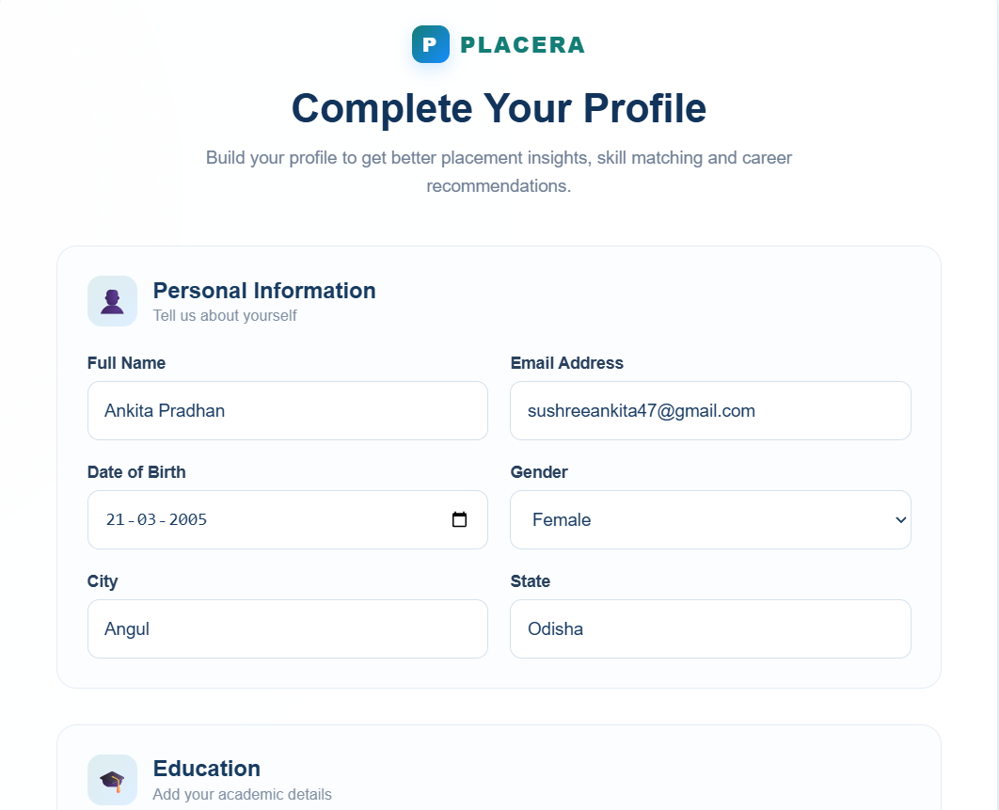

# PLACERA — Smart Campus Placement & Student Improvement Platform

> **Your placement era starts here. 🚀**

PLACERA is a Django-based campus placement platform designed to help students **track applications, analyze placement performance, identify skill gaps and rejection patterns, and receive personalized improvement suggestions**.

Unlike a basic placement tracker, PLACERA focuses on the complete student journey:

**Track → Analyze → Improve → Get Placed**

---

## 🚀 Key Features

### 🔐 Authentication & Student Profile

- Student Registration & Login
- Session-based Authentication
- Student Profile Management
- Education & Academic Details
- Resume Upload & View

### 💼 Placement Tracking

- Track Job Applications
- Job Vacancy Validation
- Automatic Required Skills
- Application Status Tracking
- Application Stage Tracking
- CSV Application Import

### 📊 Placement Performance Analysis

- Application Statistics
- Interview & Offer Tracking
- Placement Conversion Analysis
- Skill Match Percentage
- Missing Skill Identification

### 🔍 Weakness & Rejection Analysis

- Rejection Reason Tracking
- Identify Common Weakness Areas
- Analyze Performance Across Placement Stages
- Detect Skill Gaps

### 💡 Personalized Improvement

- Rule-based Improvement Suggestions
- Skill Improvement Recommendations
- Placement Preparation Guidance
- Application Journey Tracking

---

## 🔄 Application Journey

PLACERA tracks the complete placement journey:

```text
Applied
   ↓
Shortlisted
   ↓
Assessment
   ↓
Technical
   ↓
HR
   ↓
Offer


## 🎯 Skill Matching

PLACERA automatically compares the student's skills with the skills required for a selected job role.

The platform:

- Fetches required skills from the available job opening
- Compares them with the student's existing skills
- Calculates the skill match percentage
- Identifies missing skills
- Helps students understand which skills they need to improve

This allows students to make better preparation decisions before applying for a job.


## 📊 Placement Performance Analysis

PLACERA provides a clear overview of a student's placement performance.

The analysis includes:

- Total Applications
- Interviews & Selection Progress
- Offers Received
- Rejections
- Placement Conversion Rate
- Application & Interview Statistics
- Performance Across Different Placement Stages

This helps students understand their overall placement progress and identify areas that require improvement.


 🔍 Weakness & Rejection Analysis

PLACERA helps students understand why they are getting rejected during the placement process.

The platform tracks:

- Rejection Reasons
- Aptitude Performance Issues
- Coding Weaknesses
- Technical Interview Difficulties
- HR Round Issues
- Resume-related Rejections
- Eligibility-related Rejections
- Common Weakness Patterns

By analyzing rejection patterns, students can identify their most frequent problem areas and focus their preparation accordingly.


## 📥 CSV Application Import

PLACERA allows students to import multiple job applications using a CSV file.

The system:

- Reads application details from the CSV file
- Validates company and job role
- Checks job vacancy availability
- Automatically fetches required skills
- Imports valid applications
- Rejects invalid or unavailable job applications
- Displays import and rejection details

This makes it easier to manage a large number of placement applications efficiently.


## 🏢 Job Vacancy Validation

PLACERA ensures that students can apply only for available job openings.

The system checks:

- Company name
- Job role
- Available vacancy
- Active job opening
- Required skills for the selected role

If a matching vacancy is available, the required skills are automatically displayed.

If no vacancy is available, the system shows:

> No job role vacancy available in this company.

This prevents invalid applications and keeps placement data more accurate.


## 🛠️ Technology Stack

### Frontend
- HTML5
- CSS3
- JavaScript

### Backend
- Python
- Django
- Django REST Framework

### Database
- SQLite

### Tools
- VS Code
- Git
- GitHub


## 📁 Project Structure

```text
PLACERA/
├── frontend/
│   ├── index.html
│   ├── login.html
│   ├── register.html
│   ├── profile.html
│   ├── education.html
│   ├── skills.html
│   ├── dashboard.html
│   ├── applications.html
│   ├── analysis.html
│   ├── data.js
│   └── CSS & JavaScript files
│
└── backend/
    ├── manage.py
    ├── placement/
    └── placera_backend/


## ⚙️ How It Works

1. **Register & Login**  
   Students create an account and securely access their placement dashboard.

2. **Complete Profile**  
   Students add their personal, educational, academic, and skill details.

3. **Explore Job Opportunities**  
   Students select a company and job role from available openings.

4. **Validate Vacancy**  
   PLACERA checks whether the selected company and role have an active vacancy.

5. **Check Skill Match**  
   Required skills are automatically fetched and compared with the student's skills.

6. **Track Applications**  
   Students track their applications through different placement stages.

7. **Analyze Performance**  
   PLACERA analyzes applications, interviews, offers, rejections, and skill gaps.

8. **Identify Weaknesses**  
   Rejection reasons and placement patterns help identify areas that need improvement.

9. **Improve & Prepare**  
   Students receive rule-based suggestions to improve their skills and placement preparation.


## 📊 Dashboard

The PLACERA dashboard provides a centralized view of the student's placement progress.

It displays:

- Total Applications
- Interviews
- Offers
- Rejections
- Application Progress
- Placement Statistics
- Quick Access to Applications and Analysis

The dashboard helps students quickly understand their current placement status.


## 🖼️ Screenshots

### Landing Page


### Dashboard


### Applications


### Analysis


### Profile



## 🔮 Future Enhancements

Future versions of PLACERA can include:

- AI-based career recommendations
- Advanced resume analysis
- Job recommendation based on skill match
- Email notifications for placement updates
- Company-wise placement insights
- Advanced analytics and visualizations
- Interview preparation modules
- Integration with external job portals


## 🎯 Project Objective

The main objective of PLACERA is to help students make better placement decisions by combining **application tracking, skill matching, performance analysis, weakness identification, and personalized improvement suggestions** in a single platform.

PLACERA goes beyond simply storing placement records — it helps students understand their placement journey and take actionable steps toward improving their chances of getting placed.


## 👩‍💻 Developer

Ankita Pradhan

B.Tech — Computer Science & Engineering  
Synergy Institute of Engineering & Technology, Dhenkanal, Odisha


> 🚀*PLACERA — Your placement era starts here.